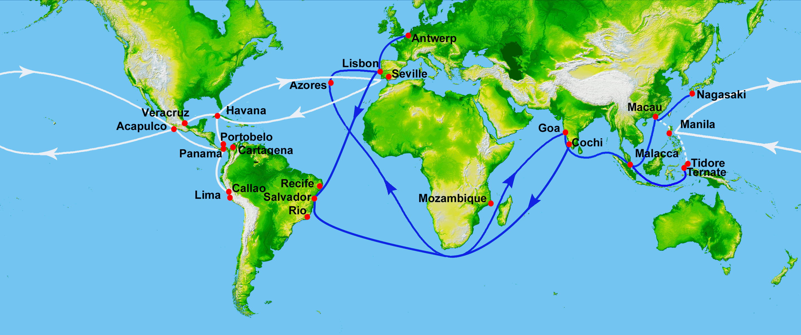
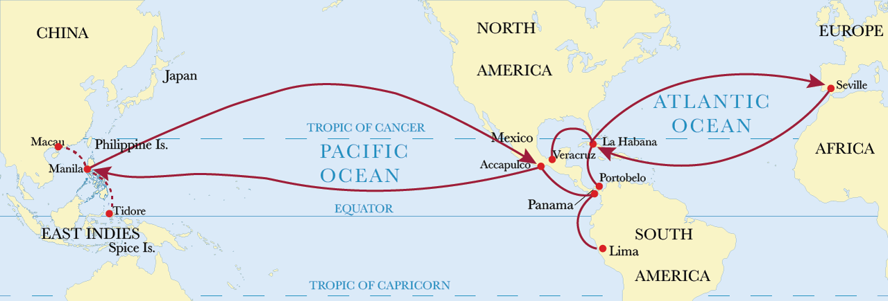
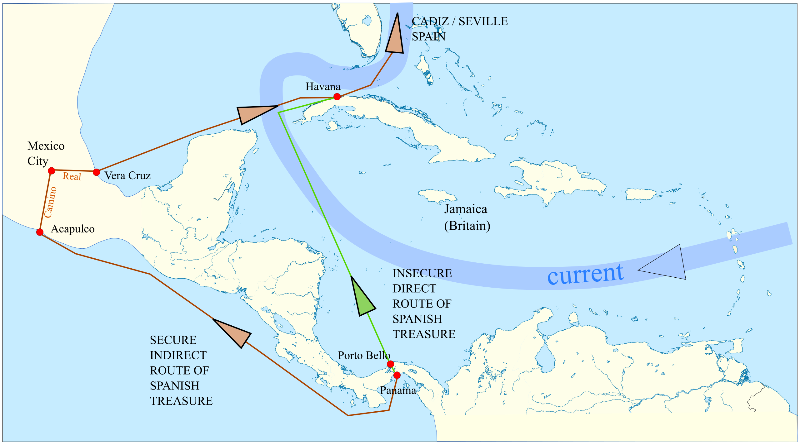
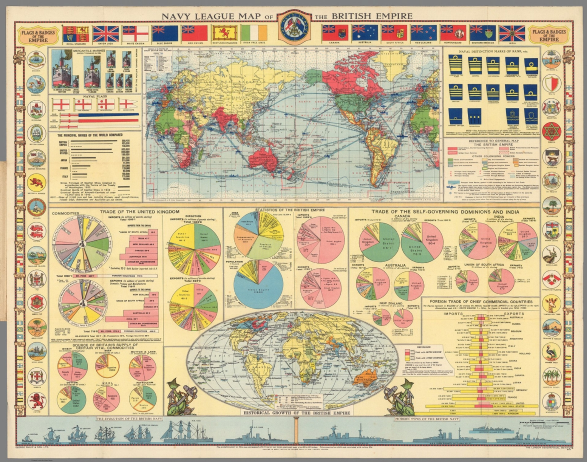
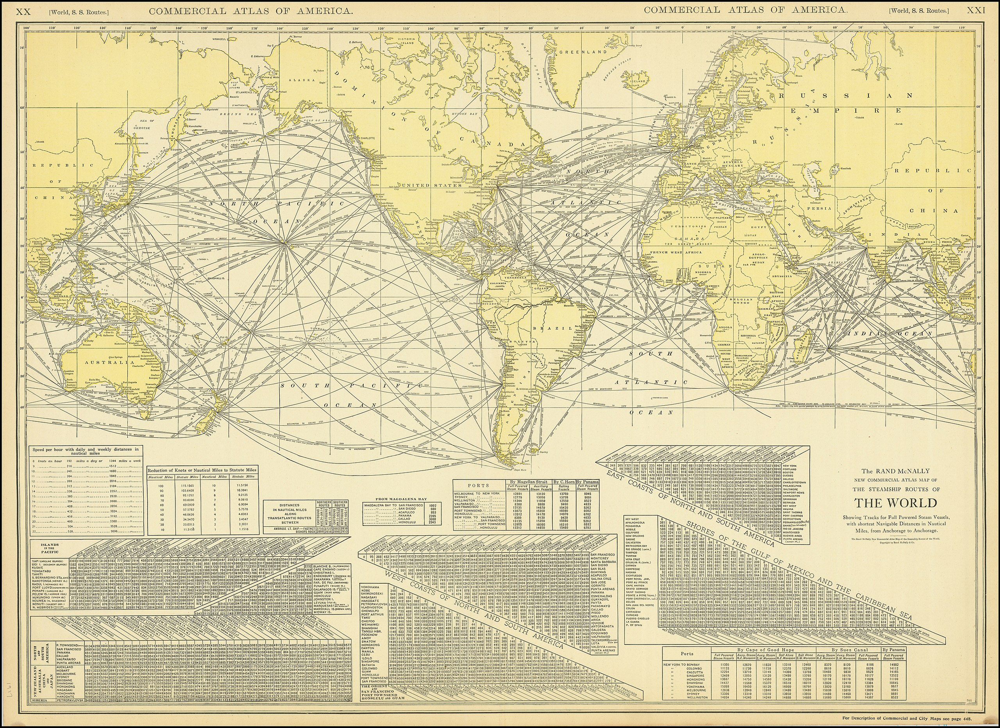
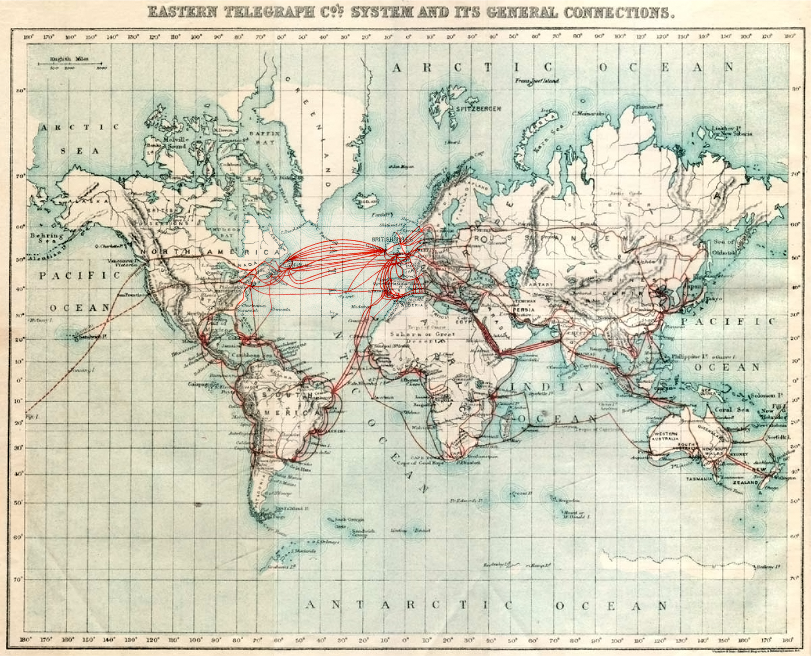

```{python}
#| include: false
import sys
sys.path.append('../scripts')
from funciones import *
import warnings
warnings.filterwarnings('ignore')

# Cargar datos
try:
    df_mundo = cargar_datos_mundo('../datos/FTWTHD')
    df_regional = cargar_datos_regionales('../datos/FTWTHD')
except Exception as e:
    print(f"Error cargando datos: {e}")
    df_mundo = None
    df_regional = None
```

# Apertura {.section}

## Pregunta central de la clase {.center-slide}

::: {.r-fit-text}
¿Por qué el comercio mundial creció 40 veces entre 1800 y 1913, y luego colapsó en apenas 30 años?
:::

Esta pregunta organiza todo lo que veremos hoy:

1. Medir ese crecimiento y colapso con datos
2. Explicar qué fuerzas lo causaron
3. Conectar historia con números

---

## Objetivos de aprendizaje

### Al terminar esta clase vas a poder:

<br>

**1.** Usar 4 indicadores básicos de comercio internacional

**2.** Describir las grandes etapas históricas (siglo XVI → siglo XX)

**3.** Aplicar un marco analítico: Tecnología + Reglas + Poder

---

## Marco analítico: tres fuerzas {.center-slide}

Para explicar **cualquier período** del comercio, preguntamos:

| Fuerza | Pregunta clave | Ejemplos |
|--------|----------------|----------|
| **Tecnología** | ¿Cuánto cuesta mover bienes? | Vela → vapor → contenedor |
| **Reglas** | ¿Quién puede comerciar? | Monopolios, aranceles, OMC |
| **Poder** | ¿Quién garantiza estabilidad? | Hegemonía, marina, moneda |

**Idea clave:** Las tres operan juntas. Si una falla, el sistema se quiebra.


# Indicadores {.section}

## Indicador 1: Índice de comercio mundial

**Definición:**

$$I_t = 100 \times \frac{Comercio_t}{Comercio_{1913}}$$

**Interpretación:**

- El año base es **1913** (pico antes de la Primera Guerra)
- Si $I_t = 50$ → el comercio es **la mitad** del de 1913
- Si $I_t = 200$ → el comercio es el **doble** del de 1913

**¿Por qué usar un índice?** Evita problemas de inflación y permite comparar períodos largos.

---

## Índice de comercio mundial (1800-1938)

:::: {.columns}
::: {.column width="65%"}
```{python}
#| fig-width: 11
#| fig-height: 6.5
#| out-width: "100%"
#| out-height: "55vh"

if df_mundo is not None:
    fig, ax = grafico_indice_grande(df_mundo, destacar_eventos=True)
    plt.show()
```

::: {.fuente}
Fuente: FTWTHD
:::
:::

::: {.column width="35%"}
**Cómo leer el índice:**

- 1913 = 100 (año base)
- Valor 50 = mitad del comercio de 1913
- Valor 200 = doble del de 1913

**Puntos clave:**

- 1800: 2.4 (casi nada)
- 1870: 25 (x10 en 70 años)
- 1913: 100 (pico)
- 1932: 95 (colapso -29%)
:::
::::

---

## Indicador 2: Participación regional {.center-slide}

**Definición:**

$$s_{r,t} = \frac{X_{r,t}}{X_{mundo,t}} \times 100$$

Donde:

- $s_{r,t}$ = participación de la región $r$ en el año $t$ (en %)
- $X_{r,t}$ = exportaciones de la región $r$
- $X_{mundo,t}$ = exportaciones mundiales totales

**¿Qué nos dice?** Quién comercia y cómo cambia la composición geográfica.

---

## Participación regional (1800-1938)

:::: {.columns}
::: {.column width="65%"}
```{python}
#| fig-width: 11
#| fig-height: 6.5
#| out-width: "100%"
#| out-height: "55vh"

if df_regional is not None:
    fig, ax = grafico_participacion_grande('../datos/FTWTHD')
    plt.show()
```

::: {.fuente}
Fuente: FTWTHD
:::
:::

::: {.column width="35%"}
**Cómo leerlo:**

Cada línea = % del comercio mundial de esa región.

**Datos clave:**

- Europa: 60-70% (domina)
- Américas: 10-20%
- Asia: 10-15%

**Conclusión:**

La "globalización" del siglo XIX era básicamente comercio europeo con el mundo.
:::
::::

---

## Indicador 3: Concentración (HHI)

**Definición del Índice Herfindahl-Hirschman:**

$$HHI_t = \sum_{r} (s_{r,t})^2$$

Donde $s_{r,t}$ es la participación de cada región **en decimales** (no en %).

| Valor HHI | Interpretación |
|-----------|----------------|
| **0.20** | Muy diversificado (5 regiones iguales) |
| **0.25-0.40** | Concentración moderada |
| **> 0.50** | Muy concentrado en pocas regiones |

---

## Concentración regional (HHI)

:::: {.columns}
::: {.column width="65%"}
```{python}
#| fig-width: 11
#| fig-height: 6.5
#| out-width: "100%"
#| out-height: "55vh"

if df_regional is not None:
    fig, ax = grafico_hhi_grande('../datos/FTWTHD')
    plt.show()
```

::: {.fuente}
Fuente: FTWTHD
:::
:::

::: {.column width="35%"}
**Cómo leerlo:**

- HHI alto (>0.5) = concentrado
- HHI bajo (<0.25) = diversificado

**Tendencia:**

- 1800-1914: HHI cae (más integración)
- Post-1914: HHI sube (fragmentación)

**Lección:** La globalización diversificó; las guerras fragmentaron.
:::
::::

---

## Indicador 4: Cobertura estadística

:::: {.columns}
::: {.column width="65%"}
```{python}
#| fig-width: 11
#| fig-height: 6.5
#| out-width: "100%"
#| out-height: "55vh"

fig, ax = grafico_cobertura()
plt.show()
```

::: {.fuente}
Fuente: Estimación FTWTHD
:::
:::

::: {.column width="35%"}
**¿Qué muestra?**

Países con datos por año.

**Datos:**

- 1800: ~25 países
- 1913: ~120 países

**Advertencia:**

El índice puede crecer porque hay más comercio O porque hay más países en la base. Por eso usamos índices, no valores absolutos.
:::
::::


# Historia: El Auge (1500-1913) {.section}

## Periodización histórica

| Período | Etapa | Características |
|---------|-------|-----------------|
| 1500-1650 | Economía-mundo ibérica | Monopolios, metales, rutas controladas |
| 1650-1815 | Transición | Ascenso de Holanda y UK |
| 1815-1913 | Hegemonía británica | Industria, libre comercio, globalización |
| 1914-1945 | Guerras + colapso | Desintegración del sistema |
| 1945-hoy | Orden de posguerra | Instituciones multilaterales |

---

## Etapa 1: Economía-mundo ibérica (1500-1650)

:::: {.columns}
::: {.column width="65%"}
{height="55vh"}

::: {.fuente}
Fuente: Mapas históricos
:::
:::

::: {.column width="35%"}
**Rutas ibéricas siglo XVI:**

- Portugal: ruta del Cabo → Asia
- España: Atlántico → América

**Modelo de comercio:**

Monopolios estatales (Casa de Contratación). El Estado absorbe riesgos y captura rentas.
:::
::::

---

## El Galeón de Manila: primera cadena global

:::: {.columns}
::: {.column width="65%"}
{height="55vh"}

::: {.fuente}
Fuente: Mapa histórico
:::
:::

::: {.column width="35%"}
**El circuito:**

1. Manila: sedas de China
2. Acapulco: descarga, carga plata
3. Sevilla: plata a Europa

**Primera cadena global:** Asia manufactura, América plata, Europa financia.
:::
::::

---

## Flotas y seguridad marítima

:::: {.columns}
::: {.column width="65%"}
{height="55vh"}

::: {.fuente}
Fuente: Herman Moll, c.1720
:::
:::

::: {.column width="35%"}
**Sistema de flotas:**

- Barcos viajan en convoy (piratas)
- Dos flotas anuales
- Reunión en La Habana

**Lección:** El comercio requiere seguridad. Sin ella, no hay comercio de larga distancia.
:::
::::

---

## Etapa 2: Hegemonía británica (1815-1913)

:::: {.columns}
::: {.column width="65%"}
{height="55vh"}

::: {.fuente}
Fuente: Navy League, 1922
:::
:::

::: {.column width="35%"}
**Red imperial británica:**

- Rutas marítimas globales
- Bases navales estratégicas
- Estaciones de carbón

**Diferencia con Iberia:** UK usa libre comercio + marina + libra, no monopolios.
:::
::::

---

## Tecnología: vapor + rutas regulares

:::: {.columns}
::: {.column width="65%"}
{height="55vh"}

::: {.fuente}
Fuente: Rand McNally, 1917
:::
:::

::: {.column width="35%"}
**Revolución del vapor:**

- Barcos rápidos y predecibles
- Rutas con horarios fijos
- Menor costo por tonelada

**Dato:** Costo de transporte cayó 70% (1840-1910).
:::
::::

---

## Infraestructura: cables submarinos

:::: {.columns}
::: {.column width="65%"}
{height="55vh"}

::: {.fuente}
Fuente: Eastern Telegraph, 1901
:::
:::

::: {.column width="35%"}
**Antes:** Info viajaba a velocidad del barco.

**Después:** Instantáneo.

**Consecuencias:**

- Precios se arbitran rápido
- Seguros y pagos a distancia
- Londres = centro financiero

**Lección:** Integración = mover bienes + información.
:::
::::

---

## ¿Qué significa "hegemonía británica"?

| Dimensión | Rol de UK | Efecto |
|-----------|-----------|--------|
| **Productiva** | "Taller del mundo" | Manufactura exportable |
| **Financiera** | Libra + City de Londres | Crédito y pagos internacionales |
| **Logística** | Marina mercante | Rutas predecibles |
| **Reglas** | Libre comercio | Corn Laws 1846, cláusula NMF |

<br>

**Hegemonía** = capacidad de proveer bienes públicos internacionales (moneda estable, seguridad, reglas) que benefician al hegemón y a otros.


# Historia: El Colapso (1914-1945) {.section}

## El colapso en números

:::: {.columns}
::: {.column width="65%"}
```{python}
#| fig-width: 11
#| fig-height: 6.5
#| out-width: "100%"
#| out-height: "55vh"

if df_mundo is not None:
    fig, ax = grafico_indice_colapso(df_mundo)
    plt.show()
```

::: {.fuente}
Fuente: FTWTHD
:::
:::

::: {.column width="35%"}
**Zoom 1900-1940:**

Las zonas sombreadas marcan las crisis.

**WWI (1914-18):**

- Índice: 100 → 75
- Caída: -25% en 4 años

**Gran Depresión (1929-32):**

- Índice: 133 → 95
- Caída: -29% en 3 años

El comercio colapsó más rápido que la producción.
:::
::::

---

## 1914-1918: La guerra destruye el sistema

Aplicamos el marco **Tecnología + Reglas + Poder**:

| Fuerza | Antes de 1914 | Después |
|--------|---------------|---------|
| **Tecnología** | Rutas abiertas | Bloqueos, guerra submarina |
| **Reglas** | Libre comercio, patrón oro | Controles, abandono del oro |
| **Poder** | UK hegemónico | UK debilitado, sistema fragmentado |

<br>

**Evidencia:** Índice cae de 100 (1913) a 75 (1918) = **-25% en 4 años**

---

## 1929-1932: La Gran Depresión

**Secuencia del colapso:**

1. Crisis bancaria en EUA → caída de demanda global
2. Respuesta: proteccionismo (Ley Smoot-Hawley, 1930)
3. Represalias: cada país sube aranceles
4. Bloques monetarios: área libra, área dólar, área marco
5. Resultado: cada país intenta "exportar desempleo"

<br>

**Evidencia:** Índice cae de 133 (1929) a 95 (1932) = **-29% en solo 3 años**

---

## Tres lecciones del colapso

<br>

### Lección 1: La tecnología no alcanza

Los barcos seguían existiendo en 1930. Pero el comercio cayó igual.
**Faltaban reglas y confianza.**

### Lección 2: Las reglas pueden destruir comercio

Aranceles altos + represalias = espiral descendente.
**Sin coordinación, todos pierden.**

### Lección 3: Sin hegemón, fragmentación

UK ya no podía liderar. EUA no quería hacerlo (aún).
**Resultado: bloques rivales.**


# Historia: Reconstruccion (1945-hoy) {.section}

## 1945-1973: EUA asume el rol hegemónico

| Dimensión | UK (pre-1914) | EUA (post-1945) |
|-----------|---------------|-----------------|
| **Moneda** | Libra esterlina | Dólar (Bretton Woods) |
| **Instituciones** | Tratados bilaterales | FMI, Banco Mundial, GATT |
| **Seguridad** | Royal Navy | US Navy + OTAN |
| **Apertura** | Unilateral | Multilateral (rondas GATT) |

<br>

El comercio/PIB mundial supera el nivel de 1913 **recién en los años 1970**.

---

## 1973-2008: La segunda globalización

**Cambios estructurales:**

- Fin de Bretton Woods (1971) → tipos de cambio flotantes
- Contenedores, jets, internet → costos colapsan
- China entra a la OMC (2001) → "fábrica del mundo"

<br>

**Resultado:**

- Comercio crece **2x más rápido** que el PIB
- Trade/GDP mundial: 25% (1970) → 60% (2008)

---

## 2008-hoy: ¿Slowbalization?

| Período | Evento | Impacto |
|---------|--------|---------|
| 2008-09 | Crisis financiera | Comercio cae 12% |
| 2018-20 | Guerra comercial EUA-China | Aranceles, incertidumbre |
| 2020-22 | Pandemia COVID-19 | Disrupción de cadenas |
| 2022-hoy | Guerra Ucrania | Nearshoring, friendshoring |

<br>

**Pregunta abierta:** ¿Estamos en un nuevo colapso tipo 1914-1932?


# Cierre {.section}

## Cómo conectamos historia y medición

**Checklist para analizar cualquier etapa:**

1. **Tecnología:** ¿Cuánto cuesta mover bienes e información?
2. **Reglas:** ¿Quién puede comerciar y bajo qué condiciones?
3. **Poder:** ¿Quién garantiza estabilidad?
4. **Datos:** ¿Qué indicador usar? (índice, participación, HHI)

---

## Lo que nos llevamos

::: {.columns}
::: {.column width="50%"}
### Un gráfico

El índice 1800-1938: auge → pico → colapso

### Un marco

**Tecnología + Reglas + Poder**

Aplicable a 1870, 1930, o 2024
:::

::: {.column width="50%"}
### Cuatro indicadores

- Índice (nivel relativo)
- Participación regional
- HHI (concentración)
- Cobertura estadística

### Una lección

La integración **no es automática ni irreversible**
:::
:::

---

## Pregunta que queda abierta

<br>

### ¿Qué determina si un país GANA o PIERDE con el comercio?

<br>

Las teorías responden esto:

- **Smith** (Clase 3): ventajas absolutas
- **Ricardo** (Clase 4): ventajas comparativas
- **Heckscher-Ohlin** (Clase 6): dotación de factores
- **Prebisch** (Clase 11): centro-periferia

---

## Próxima clase: Balanza de pagos

**Temas de la Clase 2:**

- Cuenta corriente y cuenta financiera
- Tipo de cambio nominal y real
- ¿Qué significa "competitividad externa"?

<br>

**Lectura recomendada:** @krugman2022, Capítulo 1

---

## Referencias

::: {#refs}
:::
